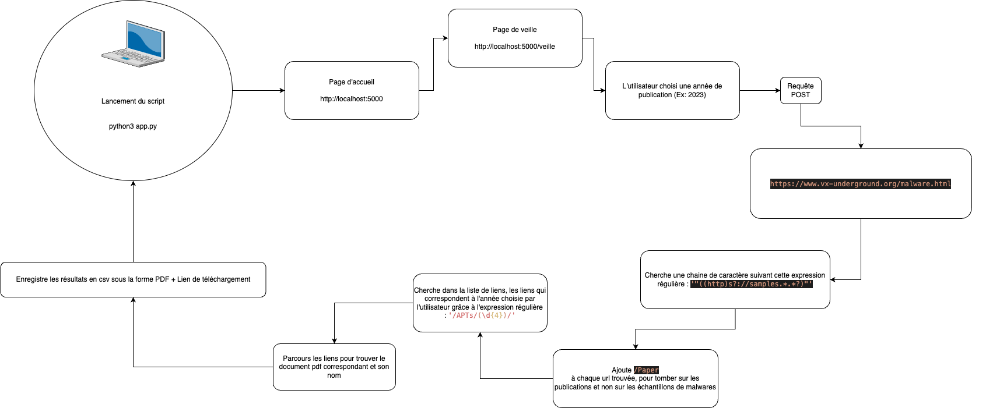

# Veille Technologique

Sujet : ***Advanced Persistent Threats (Menaces Persistantes Avancées)***
Année : 2023

La veille technologique se caractérise par un processus de collecte et d'analyse d'informations liées à un domaine précis. En l'occurence, le thème que j'ai choisi est l'étude des Advanced Persistent Threats (APT).
Pour une introduction aux APT, merci de vous référer au PDF : État de l'art.

#### Ressources utilisées :

Ma veille technologique se base sur les données collectées par le collectif VX Underground (https://www.vx-underground.org/) . Ce collectif répertorie la plus grande collection d'echantillons de malwares et de documents d'études au sujet des Advanced Persistent Threats.

#### Outils utilisés :

- Python3
	- Librairies :
		- io
		- csv
		- flask
		- bs4
		- requests
		- re
- Flask
- HTML/CSS

#### Fonctionnement de ma veille:

L'utilisateur entre une année de publication et recevra un fichier csv comportant tous les articles techniques de l'année relatifs à l'étude des APT ainsi qu'un lien de téléchargement vers les dits PDF.

#### Installation :

- git clone https://github.com/ilostmypassword/veille.git
- cd veille
- pip3 install -r requirements.txt

#### Guide d'utilisation :

- python3 app.py
	- Le lancement du script ouvrira un serveur web sur le port 5000
- Ouvrez un navigateur et allez sur :
	- http://localhost:5000/
- Cliquer sur le bouton "Veille Technologique"
- Choisissez une année (Ex: 2023)
- Le téléchargement du csv se fera automatiquement

#### Axes d'améliorations et ajouts de fonctionnalités :

- [ ] Gestion du cache pour la rapidité des processus.
- [ ] Filtrer par pays.
- [ ] Filtrer par mot clés

#### Remerciements : 

**VX Underground Staff:**

Founder and manager: smelly  
Malware sample curation: Petik  
APT sample curation: f0wl  
Infrastructure: Duchy  
Paper curation: Bradley  
Research and development coordinator: b0t  
Editor and general assistance: Helen Of Tor  
General assistance: Disrel
